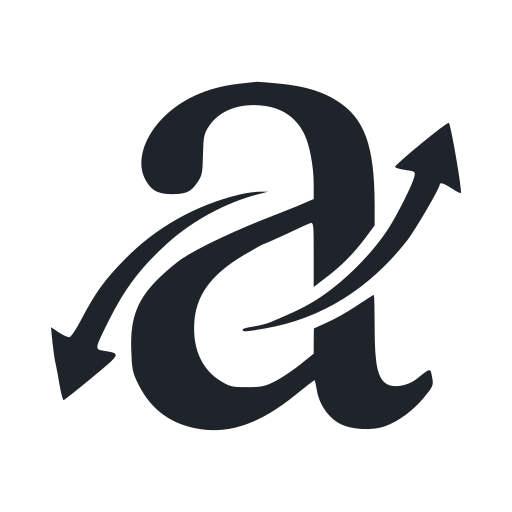

<br>

<p align="center">
  <picture>
    <source media="(prefers-color-scheme: dark)" srcset="assets/logo-mono-dark.png">
    
  </picture>
</p>

<h1 align="center">ablaut</h1>

<p align="center">Fast, correct verb conjugation for 18 languages.</p>

<br>

<p align="center">
  <a href="https://crates.io/crates/ablaut"></a>
  <a href="https://pypi.org/project/ablaut/"></a>
  <a href="https://www.npmjs.com/package/@v4nn4/ablaut"></a>
  <a href="https://github.com/ablaut-dev/ablaut/actions/workflows/ci.yml"></a>
  
</p>

<p align="center"><a href="https://ablaut.dev"><b>Try it in the browser</b></a></p>

<br>

The name is the German term for the vowel gradation in *singen, sang,
gesungen*: Jacob Grimm formalized its seven classes in 1819, and they
still describe every strong verb in the language.

## Highlights

- **Measured correctness.** Every language is validated against two
  independent machine-readable lexicons. Where the two sources agree,
  ablaut has zero known errors in seventeen of eighteen languages; the
  remaining disagreements are ruled on in published adjudication logs.
  CI re-checks 3.5 million forms on every change.
- **Generalizes to unseen verbs.** Rule engines with curated exception
  tables, not lookup dumps: novel verbs (*googeln*, *tweeter*)
  conjugate correctly.
- **Fast and small.** No I/O, no runtime data files, no dependencies in
  the core crate. A full table takes microseconds; all eighteen
  languages fit in one small WebAssembly binary.
- **Permissively licensed.** MIT OR Apache-2.0. Reference lexicons are
  used at test time only and never shipped.

## Languages

German, French, Spanish, Catalan, Portuguese, Italian, Romanian,
Swedish, English, Danish, Czech, Slovenian, Estonian, Finnish, Irish,
Ukrainian, Icelandic, and Japanese.

Each language is scored against the slots where its two reference
lexicons agree; the second column is that score.

| | Language | Verified forms | Accuracy |
|---|---|---:|---:|
| 🇩🇪 | German | 194,254 | 99.2% |
| 🇫🇷 | French | 284,034 | 100.00% |
| 🇪🇸 | Spanish | 339,200 | 100.00% |
| 🇦🇩 | Catalan | 187,186 | 100.00% |
| 🇵🇹 | Portuguese | 373,163 | 100.00% |
| 🇮🇹 | Italian | 280,143 | 100.00% |
| 🇷🇴 | Romanian | 225,494 | 100.00% |
| 🇸🇪 | Swedish | 39,453 | 100.00% |
| 🇬🇧 | English | 74,600 | 100.00% |
| 🇩🇰 | Danish | 20,205 | 100.00% |
| 🇨🇿 | Czech | 107,812 | 100.00% |
| 🇸🇮 | Slovenian | 10,757 | 100.00% |
| 🇪🇪 | Estonian | 24,184 | 100.00% |
| 🇫🇮 | Finnish | 406,209 | 100.00% |
| 🇮🇪 | Irish | 27,404 | 100.00% |
| 🇺🇦 | Ukrainian | 71,990 | 100.00% |
| 🇮🇸 | Icelandic | 5,749 | 100.00% |
| 🇯🇵 | Japanese | 9,421 | 100.00% |

Details per language, including which lexicons are used and every
adjudicated disagreement, live in `docs/{lang}/`.

## Usage

### Rust

```sh
cargo add ablaut
```

```rust
use ablaut::{conjugate, Conjugation, Lang};

match conjugate("vorbi", Lang::Ron)? {
    Conjugation::Ron(t) => assert_eq!(t.present[0], "vorbesc"),
    _ => unreachable!(),
}
```

Per-language modules expose richer APIs; the shared contract is
`Verb::from_infinitive` and `Table::build`:

```rust
use ablaut::{Mood, Number, Person, Tense, Verb};

let v = Verb::from_infinitive("aufstehen")?;
v.conjugate(Tense::Present, Mood::Indicative, Person::First, Number::Singular);
// "stehe auf"

use ablaut::fra;
let v = fra::Verb::from_infinitive("appeler")?;
v.conjugate(fra::SimpleTense::Future, fra::Person::First, fra::Number::Singular);
// "appellerai"
```

Reverse lookup maps a conjugated form back to its infinitive(s) and
the slots it fills — fully productive for German, English, French and
Spanish, irregular-index-backed for all 18 languages:

```rust
use ablaut::{reverse, Lang};

let m = reverse("suis", Lang::Fra);
// être (present 1sg) and suivre (present 1sg, present 2sg)
assert_eq!(m.len(), 2);
assert_eq!(reverse("war", Lang::Deu)[0].infinitive, "sein");
assert_eq!(reverse("hablé", Lang::Spa)[0].infinitive, "hablar");
```

### Python

```sh
pip install ablaut
```

```python
import ablaut

c = ablaut.conjugate("aufstehen")   # German is the default
c.present[0]                        # "stehe auf"
c.auxiliary                         # "sein"

ablaut.conjugate("appeler", lang="fr").present[0]  # "appelle"
ablaut.conjugate("delati", lang="sl").present[3]   # "delava" (the dual)
```

Wheels are abi3 (Python 3.11+); no Rust toolchain needed.

### WebAssembly

```sh
wasm-pack build --target web -- --features wasm
```

```js
import init, { conjugate } from "./pkg/ablaut.js";
await init();
conjugate("aufstehen").present[0];   // "stehe auf"
conjugate("andare", "it").auxiliary; // "essere"
```

Language codes are ISO 639-1/-3 or English names, case-insensitive.

## Coverage

Each language covers its full synthetic paradigm plus the analytic
tenses of its written standard: German's separable prefixes and both
Konjunktiv rows, French spelling doublets and reflexive clitics,
Spanish enclitic imperatives with written stress, Portuguese's personal
infinitive, Italian's perfect auxiliary, Romanian's synthetic
pluperfect, the Scandinavian s-passives, Czech gendered participles,
Slovenian's dual, Estonian and Finnish impersonals and potentials, and
Irish's initial mutations. [`docs/design.md`](docs/design.md) documents
the German engine in depth; each other language documents its scope in
`docs/{lang}/oracles.md`.

## How correctness is verified

For each language, two independently derived lexicons (a Wiktionary
extraction and a national or academic resource) are converted to a
common format. The engine is scored on every slot where the two agree,
and CI fails if accuracy regresses. Disagreements between the sources
are ruled on case by case in `docs/{lang}/adjudications.tsv`, with
references to standard grammars. The process regularly finds errors in
the reference data itself; several fixes have been filed upstream.

## Design

Each engine is a productive default rule plus a finite table of stored
exceptions, the dual-mechanism model of inflection (Marcus, Pinker et
al., 1995). Features follow the
[UniMorph schema](https://unimorph.github.io/).

## License

MIT OR Apache-2.0.

**Data provenance**: the exception tables are factual data about each
language (principal parts, class membership, auxiliaries), established
by the agreement of independent sources and verified against reference
grammars. The reference lexicons themselves are fetched at development
time and never shipped, whatever their license.
