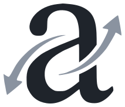

<br>

<p align="center">
  <picture>
    <source media="(prefers-color-scheme: dark)" srcset="assets/logo-dark.svg">
    
  </picture>
</p>

<h1 align="center">ablaut</h1>

<p align="center">Fast, correct verb conjugation for 15 European languages —<br>every one verified against two independent gold lexicons.</p>

<br>

<p align="center">
  <a href="https://crates.io/crates/ablaut"></a>
  <a href="https://pypi.org/project/ablaut/"></a>
  <a href="https://www.npmjs.com/package/@v4nn4/ablaut"></a>
  <a href="https://github.com/v4nn4/ablaut/actions/workflows/ci.yml"></a>
  
</p>

<p align="center"><a href="https://ablaut.dev"><b>Try it in the browser</b></a></p>

<br>

The name is the German term for the vowel gradation in *singen, sang,
gesungen*: Jacob Grimm formalized its seven classes in 1819, and they still
describe every strong verb in the language. German was the first engine;
the discipline it established now covers fifteen languages.

## Highlights

- **Measured correctness, not vibes.** Each language ships with a
  *verification loop*: two independently-derived machine-readable gold
  sources (a Wiktionary-lineage extraction crossed with a national or
  academic lexicon), their agreement as ground truth, and the engine
  iterated until nothing disagrees. Fourteen languages stand at
  **100.00%** on their agreement gold; every oracle disagreement is ruled
  on in a published adjudication log. CI re-scores every language against
  its second oracle on every pull request — 3.5 million forms per run.
- **Rules first, data second.** Each engine is a productive rule system
  plus a mined exception table, not a lookup dump: novel verbs
  (*googeln*, *tweeter*, *tvuíteáil*) conjugate correctly.
- **Fast and small.** No I/O, no runtime data files, no dependencies in
  the core crate. A full table takes microseconds; all fifteen languages
  compile into one WebAssembly binary of well under a megabyte.
- **Permissively licensed.** MIT OR Apache-2.0. Gold oracles are used at
  test time only and never shipped.

## Languages

| | Language | Second oracle | Agreement gold | CI gate |
|---|---|---|---:|---:|
| 🇩🇪 | German | [UniMorph deu](https://github.com/unimorph/deu) | 194k forms† | 99.1% |
| 🇫🇷 | French | [Lefff](https://alpage.inria.fr/~sagot/lefff-en.html) | 284,034 · 100.00% | 100.00% |
| 🇪🇸 | Spanish | [FreeLing](https://nlp.lsi.upc.edu/freeling/) | 339,200 · 100.00% | 99.98% |
| 🇵🇹 | Portuguese | [MorphoBr](https://github.com/LR-POR/MorphoBr) | 373,163 · 100.00% | 99.95% |
| 🇮🇹 | Italian | [Morph-It!](https://docs.sslmit.unibo.it/doku.php?id=resources:morph-it) | 280,143 · 100.00% | 99.57% |
| 🇷🇴 | Romanian | [dexonline](https://dexonline.ro) | 225,494 · 100.00% | 99.69% |
| 🇸🇪 | Swedish | [SALDO](https://spraakbanken.gu.se/en/resources/saldo) | 39,453 · 100.00% | 99.92% |
| 🇬🇧 | English | [AGID](https://github.com/en-wl/wordlist) | 74,600 · 100.00% | 99.85% |
| 🇩🇰 | Danish | [COR](https://ordregister.dk) | 20,205 · 100.00% | 99.98% |
| 🇨🇿 | Czech | [MorfFlex CZ](https://ufal.mff.cuni.cz/morfflex) | 107,812 · 100.00% | 99.99% |
| 🇸🇮 | Slovenian | [Sloleks](https://viri.cjvt.si/sloleks/eng/) | 10,757 · 100.00% | 99.96% |
| 🇪🇪 | Estonian | [Vabamorf](https://github.com/Filosoft/vabamorf) ⚙ | 24,184 · 100.00% | 99.79% |
| 🇫🇮 | Finnish | [Omorfi](https://github.com/flammie/omorfi) ⚙ | 406,209 · 100.00% | 98.70% |
| 🇮🇪 | Irish | [BuNaMo](https://github.com/michmech/BuNaMo) | 27,404 · 100.00% | 99.87% |

The first oracle is always the [kaikki.org](https://kaikki.org)
Wiktextract extraction for that language. † German predates the campaign
with a finer-grained harness; its loop's yield is a published register of
30+ upstream data errors. ⚙ marks *generator-as-oracle*: no downloadable
lexicon exists, so the fetch drives the open national morphology over the
shared lemma list.

Nine further EU languages are **documented skips** — each
`docs/{lang}/oracles.md` records the evidence (a license-gated second
oracle, or Wiktextract failing to expand that language's conjugation
templates) and what would unblock it. Greek, Bulgarian and Slovak are one
open-data release away.

## Usage

### Rust

```sh
cargo add ablaut
```

One entry point across all languages:

```rust
use ablaut::{conjugate, Conjugation, Lang};

match conjugate("vorbi", Lang::Ron)? {
    Conjugation::Ron(t) => assert_eq!(t.present[0], "vorbesc"),
    _ => unreachable!(),
}
```

Or the per-language modules directly, which expose each language's
idiomatic API (the shared contract is `Verb::from_infinitive` →
`Table::build`):

```rust
use ablaut::{AnalyticTense, Mood, Number, Person, Tense, Verb};

let v = Verb::from_infinitive("aufstehen")?; // German lives at the root
v.conjugate(Tense::Present, Mood::Indicative, Person::First, Number::Singular);
// "stehe auf"
v.analytic(AnalyticTense::Perfect, Mood::Indicative, Person::First, Number::Singular);
// "bin aufgestanden"

use ablaut::fra;
let v = fra::Verb::from_infinitive("appeler")?;
v.conjugate(fra::SimpleTense::Future, fra::Person::First, fra::Number::Singular);
// "appellerai"

use ablaut::gle;
let v = gle::Verb::from_infinitive("ceannaigh")?;
v.form(gle::Tense::Future, gle::Slot::Base); // Some("ceannóidh")
```

### Python

```sh
pip install ablaut
```

```python
import ablaut

c = ablaut.conjugate("aufstehen")           # German is the default
c.present[0]        # "stehe auf"
c.auxiliary         # "sein"

ablaut.conjugate("appeler",  lang="fr").present[0]   # "appelle"
ablaut.conjugate("puhua",    lang="fi").potential[2] # "puhunee"
ablaut.conjugate("delati",   lang="sl").present[3]   # "delava" (the dual)
ablaut.conjugate("ceannaigh", lang="ga").future[0]   # "ceannóidh"
```

Wheels are abi3 (Python 3.11+); no Rust toolchain needed.

### WebAssembly

```sh
wasm-pack build --target web -- --features wasm
```

```js
import init, { conjugate } from "./pkg/ablaut.js";
await init();
conjugate("aufstehen").present[0];     // "stehe auf"
conjugate("andare", "it").auxiliary;   // "essere"
conjugate("tala", "sv").presentPassive; // "talas"
```

Language codes are ISO 639-1/-3 or English names, case-insensitive.
Input is case-folded (`VARA` → *vara*) except where capitals are
morphology (German) or lexical (*Americanize*).

## Coverage

Each language covers its full synthetic paradigm plus the analytic
tenses its written standard uses — German's two Konjunktiv rows and
separable prefixes, French's 1990 spelling doublets and reflexive
clitics, Spanish enclitic imperatives with written stress, Portuguese's
personal infinitive, Italian's `essere/avere` perfect auxiliary,
Romanian's synthetic pluperfect, the Scandinavian s-passives, Czech
gendered participles and transgressives, Slovenian's dual, Estonian and
Finnish impersonals and potentials, and Irish's synthetic-vs-analytic
slot split with a `lenite` helper for display mutation. The German
engine's full domain map lives in [`docs/design.md`](docs/design.md);
each other language documents its slot schema in
`docs/{lang}/oracles.md`.

## How correctness is verified

For each language, `scripts/{lang}/fetch_*.sh` downloads and converts
both oracles to one TSV schema (`lemma ⇥ form ⇥ V;IND;PRS;SG;1`-style
features). The golden harness (`src/bin/golden_{lang}.rs`, a thin
adapter over the shared `ablaut::harness`) scores the engine on the
slots where the two oracles agree — variant sets unioned, so either
standard spelling counts — and disagreements form the adjudication
corpus, ruled ours/theirs/both in `docs/{lang}/adjudications.tsv`
against reference grammars. CI re-scores the second oracle alone on
every pull request behind pinned regression gates.

The method finds real errors in the gold data itself: UniMorph's Spanish
table is truncated at exactly 2²⁰ rows (a spreadsheet round-trip),
AGID marks attested misspellings that polluted the variant union,
Omorfi conjugates ~500 rare derivatives with broken classes, MorfFlex
fuses clitics into forms, and Wiktionary's German entries conjugate
*entgelten* weak. Each finding is documented; several are filed
upstream.

## Design

Every engine is the same architecture: a productive default rule plus a
finite table of stored exceptions — the dual-mechanism model of
inflection (Marcus, Pinker et al., 1995) for which German morphology is
the canonical test case. The exception tables are *mined*: the engine
starts as pure rules, and every mismatch against the agreement gold is
auto-classified into the smallest data commitment that fixes it (a class
assignment where a paradigm shape covers it, an explicit principal-parts
row only where rules cannot reach). Features follow the
[UniMorph schema](https://unimorph.github.io/).

```
src/{lang}.rs        engine (deu/ is a directory, the original)
src/harness.rs       shared golden-test machinery
src/bin/golden_*.rs  per-language harness adapters
scripts/{lang}/      oracle fetchers, converters, miners
data/{lang}/         mined tables (compiled in) + gitignored oracle data
docs/{lang}/         oracle documentation + adjudication log
```

Adding a language is a recipe: pass the empirical gate (count kaikki
entries that expand ≥15 table forms — never trust entry counts), find an
independent second oracle, write the two converters, the engine, a thin
harness adapter, mine to 100%, then wire one `Lang` arm, one `conjugate`
arm, the bindings and a CI step.

## License

MIT OR Apache-2.0.

**Data provenance**: the exception tables are factual data about each
language — principal parts, class membership, auxiliaries — established
by the agreement of two independent sources and spot-ruled against
reference grammars. Gold oracles (UniMorph, Wiktextract/kaikki, Lefff,
FreeLing, MorphoBr, Morph-It, dexonline, SALDO, AGID, COR, MorfFlex,
Sloleks, Vabamorf, Omorfi, BuNaMo) are used as test-time oracles only:
fetched at development time, never shipped, whatever their license
(GPL and NC-licensed sources impose nothing on the engine).
